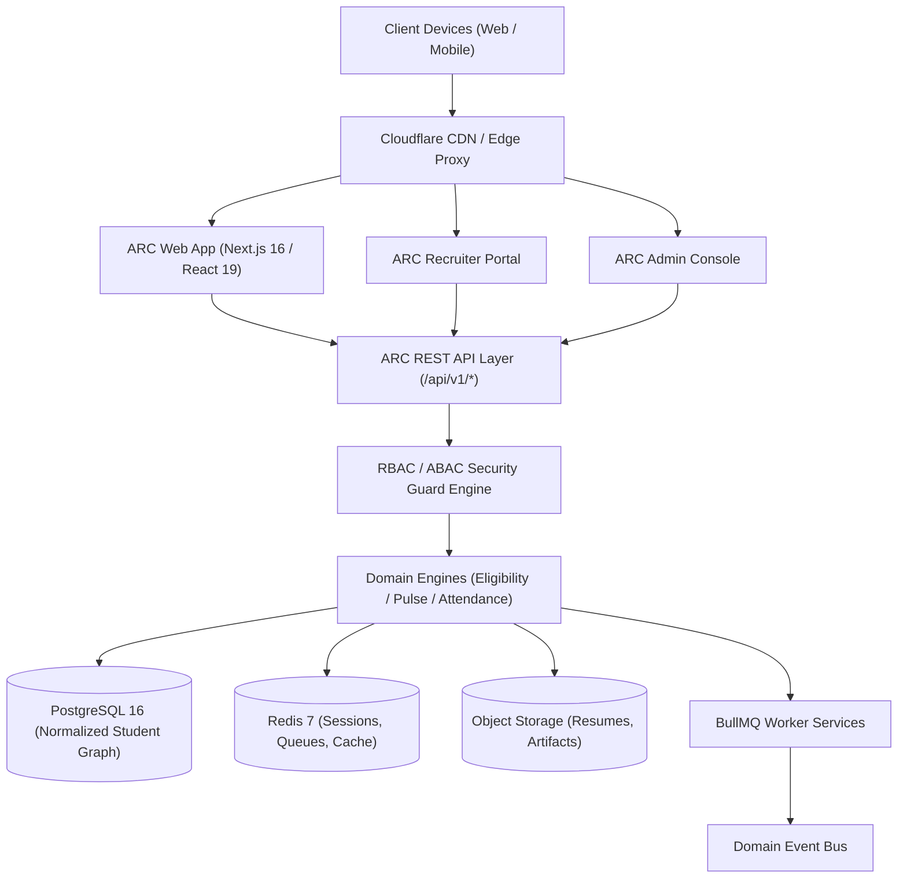

# ARC System Architecture

> **The Operating System for Modern Colleges**  
> *Academics. Talent. Careers. One Connected Ecosystem.*

---

## 1. Executive Architecture Overview

ARC replaces legacy fragmented collegiate ERPs, disconnected spreadsheets, and third-party recruiting trackers with a **single unified multi-tenant operational graph**.

---

## 2. Core Pillars

1. **ARC Student / ERP**: Academic records, real-time subject attendance with safe missable limits, timetable, courseware, and verified credits.
2. **ARC Pulse**: Evidence-backed talent intelligence transforming GitHub commits, LeetCode ratings, verified projects, and hackathon wins into explainable radar signals.
3. **ARC Placement**: Multi-stage company CRM, job drives, deterministic eligibility gates, interview scorecards, and offer releases.
4. **ARC Intelligence**: Explainable cross-platform assistant and opportunity matching layer.
